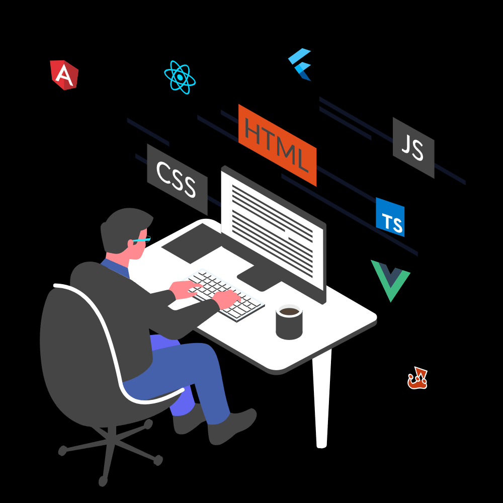

# <div align="center">Welcome to My Digital Universe!</div>

<div align="center">
  
</div>

<div align="center">
  
</div>

## <div align="center">🌟 About Me</div>


<div align="center">
  
</div>

<div align="center" style="width: 100%;">
  
</div>

```javascript
const developer = {
    name: "Siamak Khalili",
    role: "Frontend Developer",
    passion: "Turning Ideas into Digital Reality",
    currentStatus: "Freelancer & Continuous Learner",
    mindset: "Every idea deserves to come alive through code",
    
    workingOn: "Building amazing web experiences",
    learning: "Advanced React patterns & Next.js",
    openTo: "Freelance projects & collaborations",
    
    lifePhilosophy: "Code is poetry written in logic ✨"
};
```

<br clear="both"/>

## <div align="center">🛠️ Tech Arsenal</div>

<div align="center">

### Frontend Technologies


### Tools & Platforms


</div>

<div align="center">
  
</div>

## <div align="center">📊 GitHub Analytics</div>

<div align="center">
  
  
</div>

<div align="center">
  
</div>

## <div align="center">🎯 What I'm Up To</div>

<div align="center">

🔭 **Currently working on:** Building responsive web applications with React & Next.js

🌱 **Learning:** Advanced React patterns, TypeScript, and modern web technologies

👯 **Looking to collaborate on:** Innovative web projects that make a difference

💼 **Open for:** Freelance opportunities and exciting collaborations

⚡ **Fun fact:** I believe every line of code tells a story!

</div>

<div align="center">
  
</div>

## <div align="center">🤝 Let's Connect & Create Something Amazing!</div>

<div align="center">
  
[](https://t.me/SIAMAK_KHALILII)
[](https://www.instagram.com/siamak._khalili/)
[](mailto:siamak.khalili77@gmail.com)
[](https://x.com/SIAMAK_KHALILII)

</div>

<div align="center">
  
  
</div>

---

<div align="center">
  
</div>

<div align="center">
  
### 💫 *"The best way to predict the future is to create it"*
  
*Thanks for visiting! Let's build something incredible together! ⭐*

</div>

*I love connecting with different people so if you want to say hi, I'll be happy to meet you more!*
